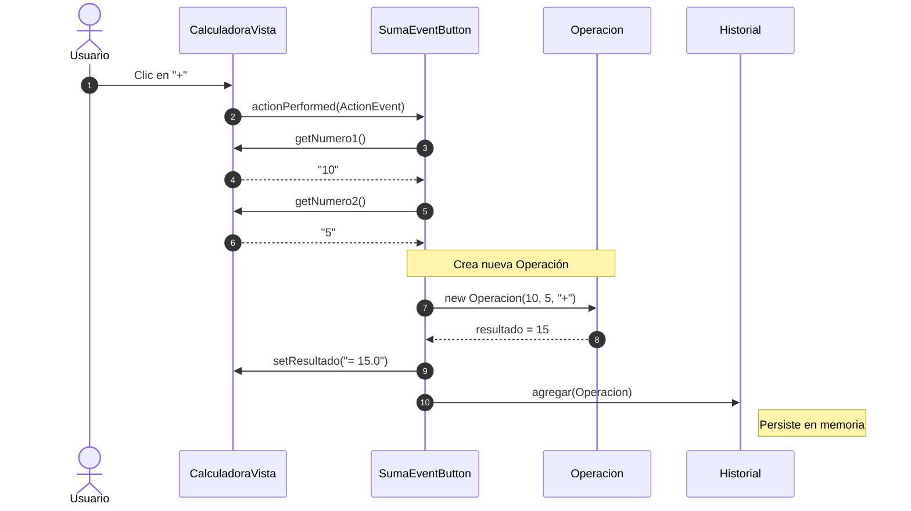

import { Aside } from '@astrojs/starlight/components';

# Gestión de Eventos Específicos

En el patrón MVC-E moderno, cada acción significativa del usuario se encapsula en su propia clase, promoviendo el principio de responsabilidad única.

## 1. Operaciones Matemáticas (Ejemplo: Suma)

La clase `SumaEventButton` coordina la lectura de la vista y la actualización del modelo.



```java
package calculadora.Controladores.Eventos;

import calculadora.Modelos.Historial;
import calculadora.Modelos.Operacion;
import calculadora.Vistas.CalculadoraVista;

public class SumaEventButton implements ActionListener {
    private CalculadoraVista v;
    private Historial h;

    public SumaEventButton(CalculadoraVista v, Historial h) {
        this.v = v; this.h = h;
    }

    @Override
    public void actionPerformed(ActionEvent e) {
        double n1 = Double.parseDouble(v.getNumero1());
        double n2 = Double.parseDouble(v.getNumero2());
        Operacion op = new Operacion(n1, n2, "+");
        v.setResultado("= " + op.resultado);
        h.agregar(op);
    }
}
```

## 2. Apertura de Historial

Esta clase demuestra cómo iterar sobre el modelo para generar la vista del historial.

```java
public class AbrirHistorialButton implements ActionListener {
    private Historial h;
    private HistorialVista hv;

    public AbrirHistorialButton(Historial h, HistorialVista hv) {
        this.h = h; this.hv = hv;
    }

    @Override
    public void actionPerformed(ActionEvent e) {
        Operacion[] datos = h.getDatos();
        String textoAcumulado = "";
        int i = 0;

        while (i < datos.length) {
            if (datos[i] != null) {
                textoAcumulado = textoAcumulado + datos[i].toString() + "\n";
            }
            i++;
        }
        hv.setTexto(textoAcumulado);
    }
}
```

<Aside type="tip" title="Enfoque Pedagógico">
  Nota el uso del bucle `while` y la validación `datos[i] != null`. Este enfoque manual de iteración y concatenación es excelente para entender cómo se procesan las colecciones de datos básicas.
</Aside>
