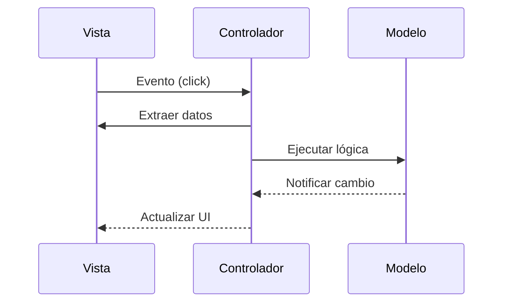

import { Aside, Steps, Badge } from '@astrojs/starlight/components';
import IconText from '@components/IconText';
import ZoomImage from '@components/ZoomImage.astro';
import imgEventLoop from '@assets/napkin_event_loop.png';

Si el diagrama de clases es el plano, el **Diagrama de Secuencia** es el video de la acción. Aquí es donde el razonamiento se vuelve dinámico.

### El Viaje de la Información

<ZoomImage src={imgEventLoop} alt="Flujo del Event Loop en MVCE" />

<Aside type="tip" title="El Relevo de Información">
¿Qué pasa realmente cuando haces clic en un botón? Es una cadena de relevos profesional:

</Aside>

### Anatomía del Relevo

<Steps>
1.  **Captura** <Badge text="Vista" variant="tip" />  
    <IconText as="div" icon="Eye" text="Interfaz" iconColor="#10b981" className="card-label text-sm" />  
    La interfaz siente el clic físico pero no sabe qué significa.

2.  **Traducción** <Badge text="Evento" variant="caution" />  
    <IconText as="div" icon="Zap" text="Evento" iconColor="#f59e0b" className="card-label text-sm" />  
    Convierte la acción del teclado/ratón en un aviso para el controlador.

3.  **Ejecución** <Badge text="Modelo" variant="note" />  
    <IconText icon="Brain" text="Lógica" iconColor="#3b82f6" className="font-bold mb-1" />  
    Donde ocurre la magia matemática, sin saber que existe una pantalla.
</Steps>

<Aside type="caution" title="Insight Maestro">
  En un diseño profesional, el **Modelo** nunca tiene un `import javax.swing`. Si el cerebro necesita llamar a la pantalla, la arquitectura está invertida.
</Aside>
