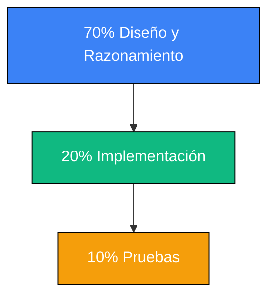

import { Aside, Card, CardGrid, Badge, Steps } from '@astrojs/starlight/components';
import IconText from '../../../../components/IconText';
import ZoomImage from '../../../../components/ZoomImage.astro';
import pillarsImg from '../../../../assets/napkin_mvce_pillars.png';

El mayor obstáculo para un programador en formación no es Java, es la **ansiedad por codificar**. Intentar escribir líneas de código sin entender el problema es como intentar construir una casa sin planos.

### ¿Diseñador o Codificador?

<ZoomImage src={pillarsImg} alt="Pilares MVCE: Modelo, Vista, Controlador, Evento" />

La metodología orientada a problemas busca invertir la pirámide de tu tiempo:

### Los Pilares del Pensamiento MVCE

No veas el patrón como una lista de archivos, sino como una **división de responsabilidades intelectuales**:

<CardGrid stagger>
  <Card title="Modelo">
    

      <IconText icon="Brain" text="Lógica" iconColor="#3b82f6" className="card-label" />
      <Badge text="La Inteligencia (Indigo)" variant="note" />
    

    
¿Qué datos manejo y qué reglas aplico? Es independiente de la interfaz.

  </Card>
  <Card title="Vista">
    

      <IconText icon="Eye" text="Interfaz" iconColor="#10b981" className="card-label" />
      <Badge text="La Apariencia (Cyan)" variant="tip" />
    

    
¿Cómo presento los datos? Es una cáscara visual sin lógica.

  </Card>
  <Card title="Evento / Controlador">
    

      <IconText icon="Puzzle" text="Conexión" iconColor="#059669" className="card-label" />
      <Badge text="La Conexión (Esmeralda)" variant="success" />
    

    
¿Cómo reacciono al usuario? Es el puente que une los dos mundos.

  </Card>
</CardGrid>

<Aside type="caution" title="Revelación Clave">
  Si puedes explicar tu lógica de negocio sin mencionar botones o tablas, has entendido el **Modelo**. Si no puedes, sigues atrapado en la **Vista**.
</Aside>
