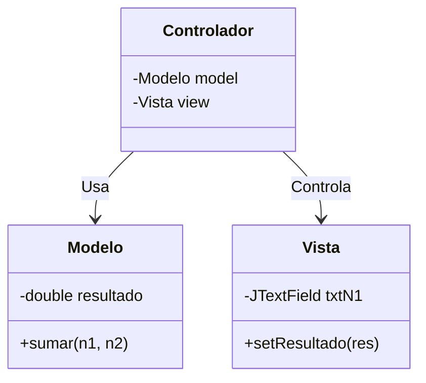

import { Aside, Card, CardGrid, Badge } from '@astrojs/starlight/components';
import IconText from '../../../../components/IconText';
import ZoomImage from '../../../../components/ZoomImage.astro';

Un buen arquitecto no construye sin planos. En el desarrollo de software, usamos el **Diagrama de Clases** para visualizar las responsabilidades antes de teclear.

### El Plano de Construcción

### Identidad de Responsabilidades

Cada componente tiene un color y un rol único en tu mente:

<CardGrid stagger>
  <Card title="Modelo">
    

      <IconText icon="Brain" text="Lógica" iconColor="#3b82f6" className="card-label" />
      <Badge text="Núcleo" variant="note" />
    

    
Contiene la verdad del negocio. Cero referencias a Swing.

  </Card>
  <Card title="Vista">
    

      <IconText icon="Eye" text="Interfaz" iconColor="#10b981" className="card-label" />
      <Badge text="Visual" variant="tip" />
    

    
Solo botones y textos. No sabe sumar, solo sabe mostrar.

  </Card>
  <Card title="Controlador">
    

      <IconText icon="Puzzle" text="Unión" iconColor="#059669" className="card-label" />
      <Badge text="Puente" variant="success" />
    

    
El pegamento que comunica el cerebro con el cuerpo.

  </Card>
</CardGrid>

<Aside type="caution" title="La Regla de Oro de la Vista">
  Si tu archivo de Vista tiene un `import java.util.Collections` o lógica de base de datos, estás rompiendo la arquitectura. **La Vista es pura cosmética.**
</Aside>

### Beneficios del Desacoplamiento

1. **Testabilidad**: Puedes probar tus cálculos sin abrir ventanas.
2. **Flexibilidad**: Cambiar de Swing a JavaFX sin reescribir la lógica.
3. **Orden**: Archivos cortos y enfocados. Menos de 100 líneas por clase.
