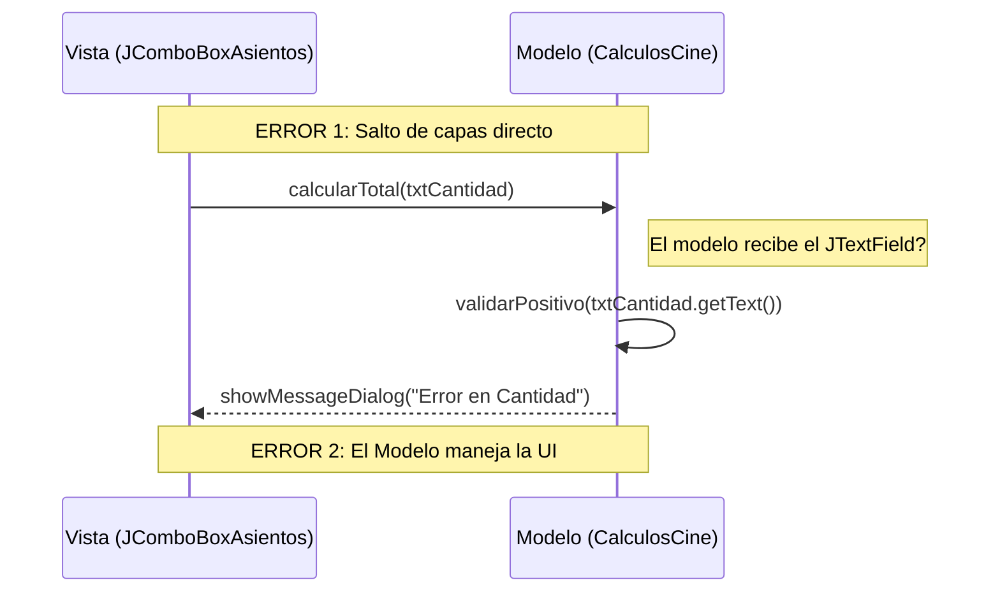
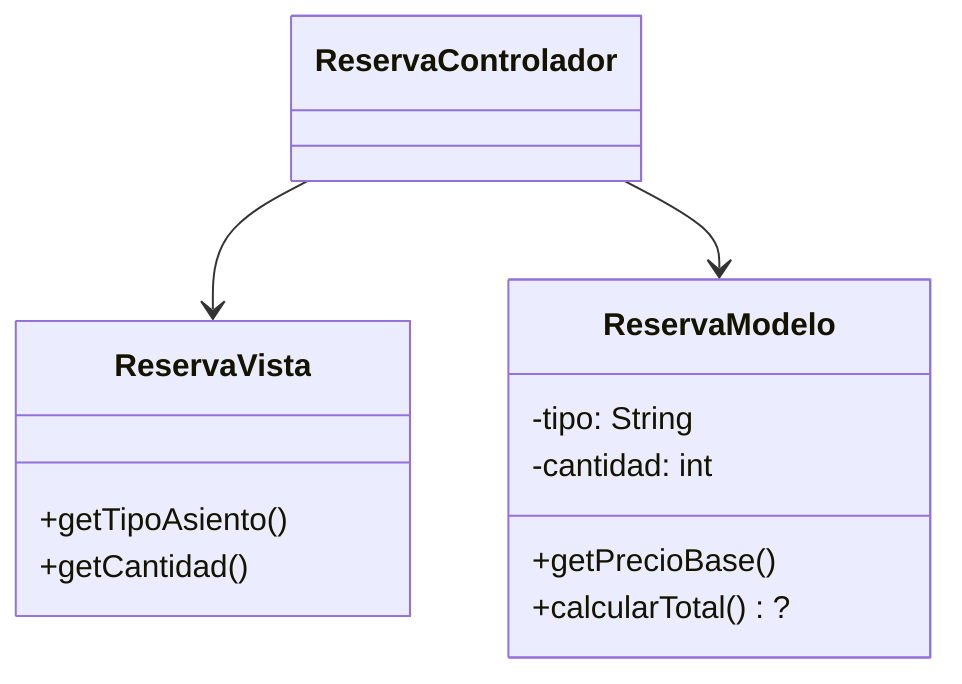
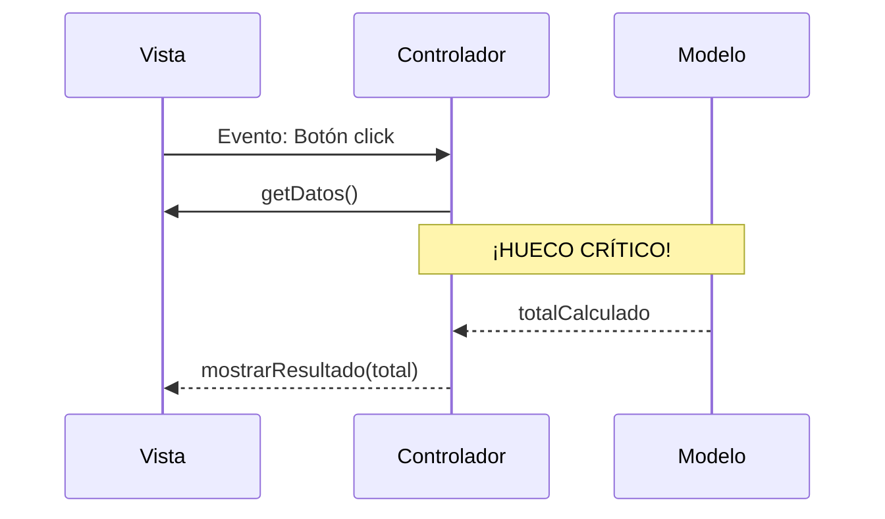
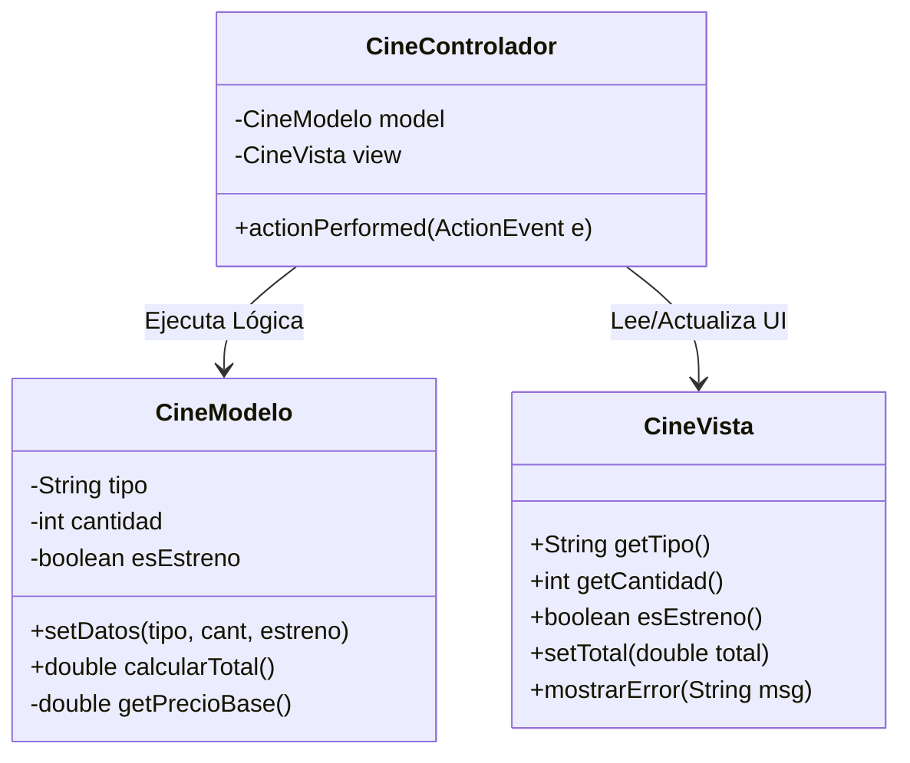
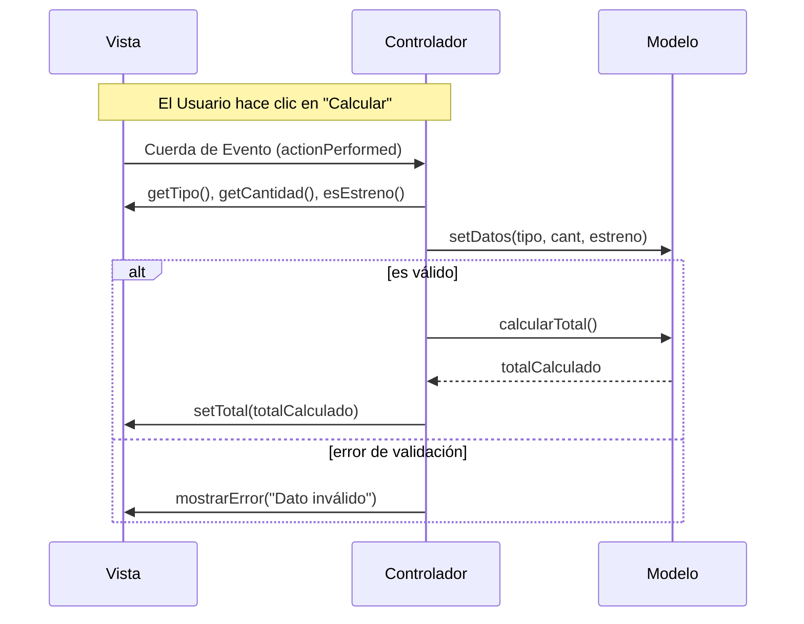

import { Aside, Card, CardGrid, Badge, Steps } from '@astrojs/starlight/components';
import IconText from '../../../../components/IconText';
import RubricaEvaluacion from '../../../../components/RubricaEvaluacion';

La excelencia no es un acto, sino un hábito. En esta sección final, te presentamos un **Reto Maestro** que integra todas las habilidades de razonamiento que hemos cultivado.

### Reto Maestro: El Gestor de Reservas de Cine

<Card title="El Escenario">
  Debes diseñar una aplicación para una sala de cine. El usuario elige entre 3 tipos de asientos e ingresa la cantidad. Tu aplicación debe cumplir con:

  <Steps>
  1.  **Validación**: Asegurar que la cantidad sea un número positivo.
  2.  **Regla de Oro**: Aplicar un cargo extra del 15% si es una función de **"Estreno"**.
  3.  **Resultado**: Mostrar un resumen detallado y el precio total final.
  </Steps>
  
  **Precios base:** General ($10) | VIP ($20) | 3D ($25)
</Card>


<Aside type="tip" title="Ejemplo de Integración">
  ```java
  // En tu Vista
  public String getTipoAsiento() {
      return (String) comboAsientos.getSelectedItem();
  }

  // En tu Controlador
  int cantidad = Integer.parseInt(vista.getCantidad());
  modelo.setCantidad(cantidad);
  ```
</Aside>

#### Tu Misión: Razonamiento Arquitectónico

Antes de programar, debes tener claras las respuestas a estas cuatro preguntas fundamentales. **Usa el sistema de pilares MVCE:**

<CardGrid>
  <Card title="Modelo">
    <div className="card-header-group">
      <IconText icon="Brain" text="Cerebro" iconColor="#3b82f6" className="card-label" />
      <Badge text="Lógica" variant="note" />
    </div>
    <p className="card-phrase">¿Dónde se calcula el precio final con el cargo de estreno?</p>
  </Card>
  <Card title="Vista">
    <div className="card-header-group">
      <IconText icon="Eye" text="Cuerpo" iconColor="#10b981" className="card-label" />
      <Badge text="Interfaz" variant="tip" />
    </div>
    <p className="card-phrase">¿Qué componentes Swing son ideales para elegir?</p>
  </Card>
  <Card title="Evento">
    <div className="card-header-group">
      <IconText icon="Zap" text="Nervio" iconColor="#f59e0b" className="card-label" />
      <Badge text="Aviso" variant="caution" />
    </div>
    <p className="card-phrase">¿Qué Listener detecta el cambio en tiempo real?</p>
  </Card>
  <Card title="Controlador">
    <div className="card-header-group">
      <IconText icon="Puzzle" text="Vínculo" iconColor="#059669" className="card-label" />
      <Badge text="Gestión" variant="success" />
    </div>
    <p className="card-phrase">¿Cómo coordina la actualización cuando el Modelo cambia?</p>
  </Card>
</CardGrid>

### Reto 0: Arquitectura Rota (Cine) 🛠️

Antes de la rúbrica, identifica los "pecados arquitectónicos" en este flujo para el **Gestor de Cine**. **Este diagrama está mal diseñado a propósito.** 

**Tu Misión:** No toques el teclado. Saca una hoja de papel y redibuja este flujo eliminando las dependencias prohibidas.



<Aside type="caution" title="¿Qué está mal aquí?">
  Identifica al menos 3 errores graves en el diagrama de arriba antes de seguir. La clave está en la **Regla de Oro de la Vista** y el aislamiento del **Modelo**.
</Aside>

### Reto 1: Completa los Planos (Gestor de Cine) 🎞️

Aquí tienes los planos para el **Gestor de Cine**, pero el arquitecto anterior dejó huecos críticos. **Tu tarea es identificar qué falta y qué está mal.**

#### A. Diagrama de Clases (Incompleto)
Identifica qué atributos y métodos faltan en el Modelo para procesar el "Cargo de Estreno" y las validaciones.



#### B. Diagrama de Secuencia (El Paso Perdido)
Este flujo intenta calcular el total, pero falta la orquestación del Controlador.



<Aside type="caution" title="Desafío de Papel">
  1. Dibuja el diagrama de clases completo con todos los métodos necesarios para el **Gestor de Cine**.
  2. En el de secuencia, identifica el "paso de orquestación" entre el Controlador y el Modelo.
</Aside>

### C. Planos Maestros (La Solución Correcta) 🏆

Una vez que hayas completado tus diagramas en papel, compáralos con la solución arquitectónica correcta. **Esta es la meta que debes alcanzar:**

#### Plano de Clases (Solución)


#### Plano de Secuencia (Solución)


<Aside type="danger" title="¡Momento de Implementar!">
  **¿El docente ya validó tus planos físicos?**  
  
  Si la respuesta es **SÍ**, ahora es el momento de transformar tus planos en realidad. Implementa el código del **Gestor de Reservas de Cine** en Java Swing siguiendo estrictamente este diseño. **¡Tu arquitectura es ahora tu guía!**
</Aside>

---

### Rúbrica de Evaluación del Reto

Usa esta rúbrica para evaluar con honestidad tu nivel de respuesta ante el problema del cine.

export const rubricData = {
  title: "Rúbrica de Razonamiento Arquitectónico MVCE",
  criteria: [
    {
      objective: "Diseño del Modelo (Lógica)",
      DA: "El cálculo del 15% de estreno y validaciones están encapsulados en el Modelo sin rastro de Swing.",
      AA: "La lógica está en el modelo, pero recibe directamente componentes de la Vista (como JCheckBox).",
      PA: "Calcula el total directamente en el actionPerformed del botón.",
      NA: "No sabe dónde colocar la regla del 15% de extra."
    },
    {
      objective: "Estructura de la Vista (UI)",
      DA: "Elige componentes óptimos (JComboBox/ButtonGroup) y define getters claros para el Controlador.",
      AA: "Sabe qué componentes usar pero los accede directamente desde el evento (e.getSource).",
      PA: "Dibuja la vista pero no sabe cómo extraer los datos de forma limpia.",
      NA: "Mezcla lógica de cálculo dentro del diseño de la interfaz."
    },
    {
      objective: "Dinámica de Eventos (Flujo)",
      DA: "Dibuja mentalmente un diagrama de secuencia donde el Evento solo 'avisa' y el Controlador 'ejecuta'.",
      AA: "El evento lee los datos y se los pasa al modelo saltándose al controlador.",
      PA: "El evento intenta hacer todo: leer, calcular y mostrar.",
      NA: "Confunde el evento con la lógica del modelo."
    },
    {
      objective: "Orquestación (Controlador)",
      DA: "El Controlador orquesta la sincronización entre Modelo y Vista limpiamente.",
      AA: "El Controlador existe pero tiene demasiada lógica que debería estar en el Modelo.",
      PA: "El Controlador solo instancia las clases pero no gestiona el flujo.",
      NA: "No utiliza una clase controladora."
    }
  ]
};

<RubricaEvaluacion data={rubricData} />

### ¿Cómo interpretar tus resultados?

- **Mayoría DA:** Estás listo para arquitecturas más complejas (Spring Boot, Microservicios). Tu pensamiento es de Arquitecto.
- **Mayoría AA:** Tienes buena base, pero necesitas confiar más en tu diseño antes de tocar el teclado.
- **Mayoría PA/NA:** No te desesperes. Vuelve a leer la sección de **Paradigma de Razonamiento** y practica descomponiendo problemas pequeños en papel.

---

### 📋 Resumen de lo que debes entregar

Para completar esta sección con éxito, prepara los siguientes materiales para **presentar físicamente a tu profesor**:

1.  **Reto 0:** Lista de los 3 pecados arquitectónicos identificados.
2.  **Reto 1:** Hoja de papel con el Diagrama de Clases completo y el Diagrama de Secuencia corregido (el "paso perdido").
3.  **Autoevaluación:** Tu nivel final según la rúbrica interactiva (puedes mostrar la pantalla o capturar el resultado).

**¡Presenta tus hojas al profesor para recibir tu evaluación final!** 🚀
